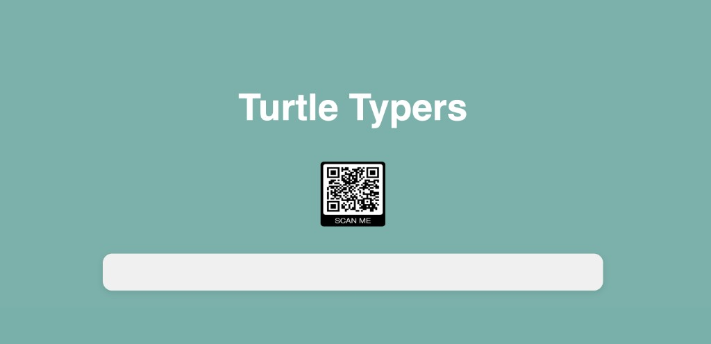

# Turtle Typers

## About this project

**Turtle Typers** is a multiplayer typing race. One screen acts as the “board”: it shows the lobby, a live race where each player’s turtle moves based on typing progress, and a podium for the top finishers. Players use their own devices (often phones) to join, enter a name, and type the same prompt as quickly and accurately as they can. Better typing moves your turtle forward; everyone sees the race unfold together in real time.

The app is a small full-stack demo: a **Node.js** server with **Express** serves the UI and hosts a **WebSocket** server (`ws`) so the display and all player clients stay synchronized. The front end uses **Vue 3** from a CDN. It works well for classrooms, parties, or any setting where you want a shared big screen plus personal keyboards.

## Screenshot

Player join screen (teal lobby, **Turtle Typers** title, scan-to-join QR, and name field):



## How it works

- **Display (host):** open [`http://localhost:3000/`](http://localhost:3000/) — lobby, live race board, and podium for 1st–3rd place.
- **Players:** open [`http://localhost:3000/player.html`](http://localhost:3000/player.html) on each device, enter a name, and join. The host starts the round from the display after everyone is in.

The server in `index.js` serves static files from `public/` and runs a WebSocket server on the same HTTP port so all clients stay in sync.

## Requirements

- [Node.js](https://nodejs.org/) (LTS recommended)

## Setup and run

```bash
npm install
node index.js
```

The app listens on **port 3000**. You should see `Server is ready...` in the terminal.

There is no `npm start` script in `package.json` yet; use `node index.js` or add a start script if you prefer.

## Local development: WebSocket URL

The front end in `public/app.js` connects to a WebSocket URL at the top of `connectSocket`. For local play, use the same host as your server, for example:

```javascript
this.socket = new WebSocket("ws://localhost:3000");
```

Comment out or remove any production URL (for example a hosted `wss://…` endpoint) while testing locally. Use `wss://` only when the page is served over HTTPS.

## Project layout

| Path | Role |
|------|------|
| `index.js` | Express app, static hosting, WebSocket game state |
| `public/index.html` | Main display / host UI |
| `public/player.html` | Player phone UI |
| `public/app.js` | Vue app, socket client, game flow |

## Optional assets

The HTML references images (for example a QR code on the lobby screen and artwork on the player page). If those files are not in `public/`, replace the paths or add the images there. Sound effects are loaded from `/sounds/` in `app.js`; add those files under `public/sounds/` if you want audio.

## License

See `package.json` (`ISC` unless you change it).
